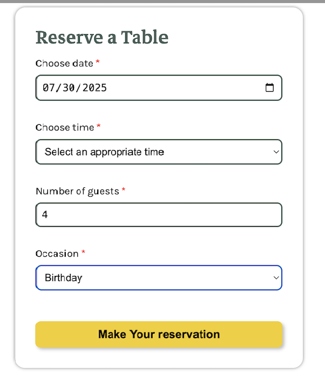
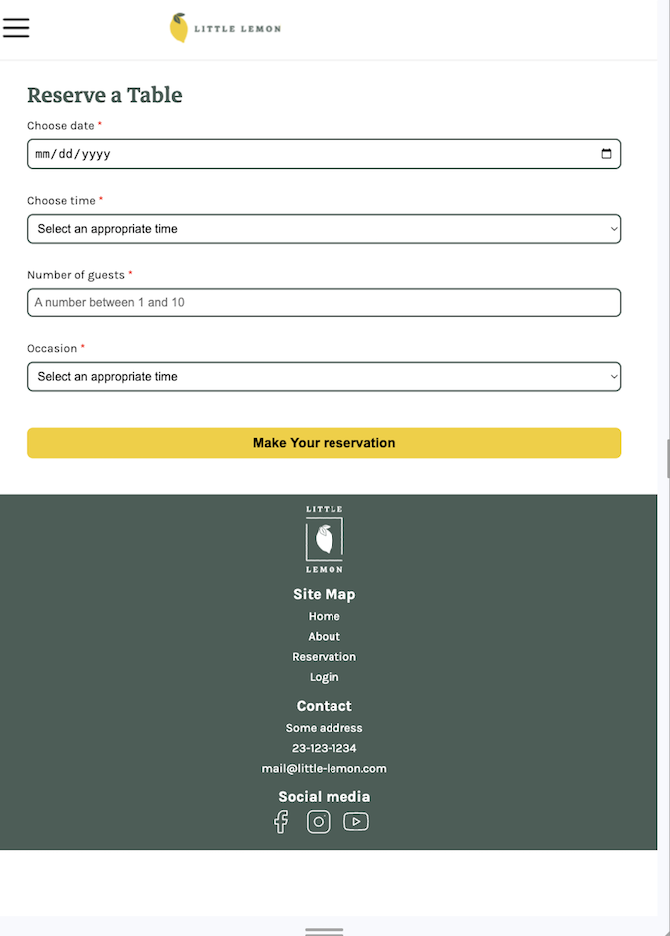

# 🍽️ Simple React JS Table Reservation for Restaurant Project

## 📌 What is the use of this Repo

This project can serve as a template for building more complex restaurant or event booking systems.
**Project Structure & Components**
1. App.js: Main entry point for the app logic
2. ReservationForm.js: Form component for booking a table
3. ReservationList.js: Displays the list of booked tables
4. ConfirmationModal.js: (If included) Displays success or confirmation modals

## 🚀 Live Demo
Check out the live version here:
👉 [View Live Demo on GitHub Pages](https://zarana-patel.github.io/TableReservation-React/)
---
## 📸 App Screenshots

📋 Website Main Page

### 📊 Reservation List



### 📊 Confirmation 


📱 Mobile Responsive View

---

## 🛠 Prerequisites

- Node.js
- npm
- Basic React knowledge
- React Bootstrap

Install the React app tool globally if needed:

```bash
npm install -g create-react-app
```

---

## 📥 Clone and Run Locally

Follow these steps to run the app on your local machine:

1. **Clone the Repository**:

```bash
git clone https://github.com/zarana-patel/TableReservation-React.git

cd TableReservation-React
```

2. **Install Dependencies**:

```bash
npm install
```

3. **Start the Development Server**:

```bash
npm start
```

This will launch the app in your browser at 👉 `http://localhost:3000`

---

## 🧩 Components

- `App.js`: Root component that maintains state and handles record list updates.
- `RecordForm.js`: Form to input name and birthday date.
- `RecordTable.js`: Displays the list of records in a table.
- `RecordRow.js`: Represents each individual record row with a delete option.

---

## 📚 Resources

- [React Documentation](https://reactjs.org/)
- [React Bootstrap Docs](https://react-bootstrap.github.io/)
- [Create React App Guide](https://github.com/facebook/create-react-app)
- [Formik Docs](https://formik.org/docs/api/formik)

